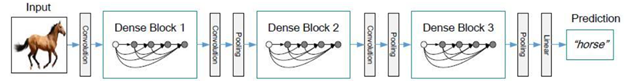

# kk_cv_new

## ImageNet 1000分类标签

[ImageNet1000分类标签](https://blog.csdn.net/winycg/article/details/101722445)

## 经典CNN网络架构

### LeNet-5

[LeNet-5详解](https://blog.csdn.net/qq_40714949/article/details/109863595?ops_request_misc=%257B%2522request%255Fid%2522%253A%25224862736709d914d89da4f6f9fdf4ac74%2522%252C%2522scm%2522%253A%252220140713.130102334..%2522%257D&request_id=4862736709d914d89da4f6f9fdf4ac74&biz_id=0&utm_medium=distribute.pc_search_result.none-task-blog-2~all~top_positive~default-1-109863595-null-null.142^v100^pc_search_result_base4&utm_term=lenet5&spm=1018.2226.3001.4187)

[LeNet-5论文](paper/Gradient-Based%20Learning%20Applied%20to%20Document%20Recognition.pdf)

### AlexNet

[AlexNet详解](https://blog.csdn.net/guzhao9901/article/details/118552085)

[AlexNet论文](paper/imagenet-classification-with-deep-convolutional-neural-networks-Paper.pdf)

### VGG

[VGG详解](https://blog.csdn.net/qq_37541097/article/details/104410535)

[VGG论文](paper/Very%20Deep%20Convolutional%20Networks%20for%20Large-Scale%20Image%20Recognition.pdf)

### GoogleNet

[GoogleNet详解](https://blog.csdn.net/qq_37555071/article/details/108214680)

[GoogleNet论文V1](paper/Rethinking%20Convolutional%20Semantic%20Segmentation%20Learning.pdf)

[GoogleNet论文V2V3](paper/Rethinking%20the%20Inception%20Architecture%20for%20Computer%20Vision.pdf)

[GoogleNet论文V4](paper/Inception-v4.pdf)

### ResNet

[ResNet详解](https://blog.csdn.net/forGemini/article/details/119295532)

[ResNet论文](paper/Deep%20Residual%20Learning%20for%20Image%20Recognition.pdf)

### SENet

[SENet详解](https://blog.csdn.net/Roaddd/article/details/111357490)

[SENet论文](paper/SENet.pdf)

### DenseNet

[DenseNet详解](https://blog.csdn.net/weixin_45422462/article/details/108416893)

[DenseNet论文](paper/densenet.pdf)

### MobileNet

[MobileNet详解](https://blog.csdn.net/binlin199012/article/details/107155719)

[MobileNet论文](paper/mobilenetv1.pdf)

[MobileNet论文V2](paper/mobilenetv2.pdf)

[MobileNet论文V3](paper/mobilenetv3.pdf)

[MobileNet论文V4](paper/mobilenetv4.pdf)

### ShuffleNet

[ShuffleNet详解](https://blog.csdn.net/weixin_48249563/article/details/110222269)

[ShuffleNet论文V1](paper/shufflenetv1.pdf)

[ShuffleNet论文V2](paper/shufflenetv2.pdf)

### 一个简单的图像检索系统demo （代码在projects/image_search）

**业务目标**: 完成一个以图搜图的系统demo，最终目标是返回用户给定的图像的相似图像
  
从我们自有的图像库中进行检索，最终返回和用户图像相似的K个图像

**最终产出**: 产生一个HTTP的接口，接口接受一个图像的输入，最终返回和该图像最相似的K个图像

**在线流程**:
 
 1. 接受传递过来的图像参数，进行图像的恢复
 
    - 图像的传递方式：--->base64图像编码进行传递

 2. 调用模型获取图像特征: 
    - 图像预处理方式：---> OpenCV、PIL、torchvision
    - 如何从模型中提取图像特征：
        - 首先训练一个分类模型
        - 当分类模型训练完成后，最后一层的特征向量作为当前图像的特征向量

 3. 基于图像特征进行相似图像的检索并返回
    - 如何检索?
      - 离线部分/模型训练完成后，需要将图像库中的所有图像采用步骤2的方式获取对应的特征向量，并构建索引库
      - 基于图像库中的所有图像特征向量构建向量索引
      - 基于向量索引和当前图像特征直接返回最相似的K个图像

    - 新增图像：直接将新图像对应的向量添加到索引即可

**技术路线**: 

- 使用经典分类模型提取图像特征
- 使用Faiss构建图像的索引库
- 使用Flask提供API接口
- 使用Streamlit构建Web应用

**模型训练**：

1. 模型类型：二分类模型
2. 基础模型：ResNet50
3. 模型训练方式：迁移学习训练
4. 模型训练数据：kaggle猫狗数据集
5. 模型训练环境：GPU